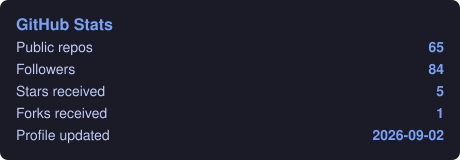
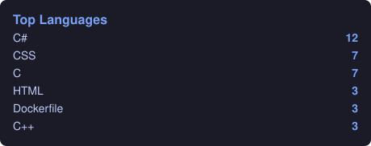

# Hi there, I'm Christian Grimberg! 

  

    
    
    
  

## 👨‍💻 About Me

I'm a **Systems Administrator & Solutions Architect** with 10+ years in the pharmaceutical industry, focused on enterprise backend, DevOps automation, and AI-assisted development.

- 🔭 Currently working on **Enterprise Architecture with .NET 10** and **AI Agent Orchestration**.
- 🌱 Deep focus on **DevOps automation**, **PowerShell** scripting, and **cloud infrastructure** (Azure).
- 🤖 I believe AI boosts developer productivity — I keep my own conventions in [`AGENTS.md`](./AGENTS.md) so any agent can pair with me.
- ⚡ Fun fact: I automate everything; if I have to do it twice, I write a script.

## 📊 GitHub Stats

  
  

> Stats are auto-generated every 6 hours by [`.github/workflows/stats.yml`](.github/workflows/stats.yml) using the official GitHub API — no third-party services.

## 🛠️ Tech Stack

<b>Backend & Languages</b>

  
  
  
  

<b>Databases</b>

  
  

<b>DevOps & Cloud</b>

  
  
  
  
  
  
  

<b>Platforms & Hardware</b>

  
  
  
  

<b>AI Coding Tools</b>

  
  

## 🏆 Certifications

  
  
  

---

  <i>"Technology is best when it brings people together." — Matt Mullenweg</i>

